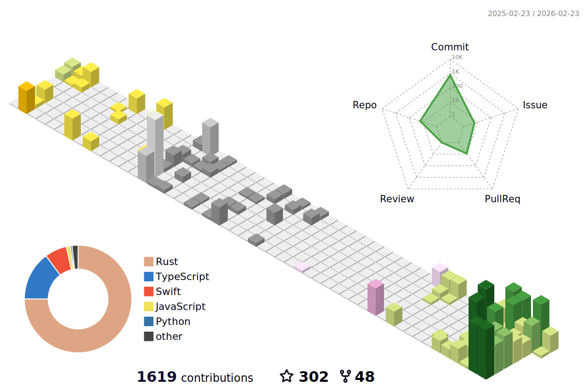

### Welcome !

#### 我的博客 [代码手工艺人](https://xueshi.io)

**Projects I'm working on:**

• [PastePaw](https://github.com/XueshiQiao/PastePaw) - 🐾 An elegant clipboard history manager for Windows 🐾  
• [netstat-cat ](https://github.com/XueshiQiao/netstat-cat) - GUI application for netstat for macOS and Windows 
• [GlobalVimLikeNavi](https://github.com/XueshiQiao/GlobalVimLikeNavi) - Make your capslock powerful 
• [Notifier](https://github.com/XueshiQiao/Notifier) - Never miss a AI Agent prompt again 

