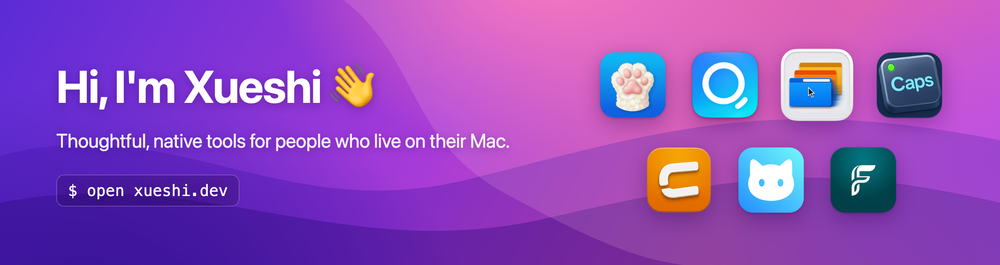
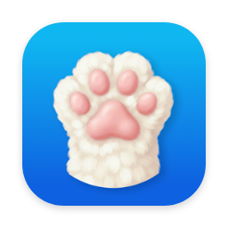
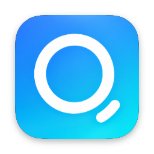
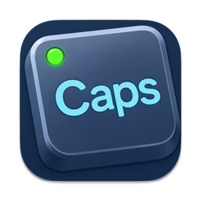
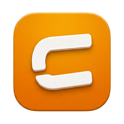
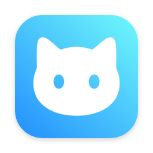
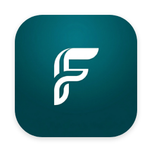

<h3 align="center">🛠 Apps I build and use every day</h3>

<a href="https://xueshi.dev">xueshi.dev</a> · <a href="https://x.com/XueshiQiao">@XueshiQiao</a>

<table align="center">
<tr>
<td align="center" width="33%" valign="top"><a href="https://pastepaw.com"> <b>PastePaw</b></a> Clipboard history manager macOS · <a href="https://github.com/XueshiQiao/PastePaw">Windows</a></td>
<td align="center" width="33%" valign="top"><a href="https://github.com/XueshiQiao/qduo"> <b>QDuo</b></a> Your own actions on any selected text macOS</td>
<td align="center" width="33%" valign="top"><a href="https://github.com/XueshiQiao/AnyDrag"> <b>AnyDrag</b></a> Drag any window from anywhere macOS</td>
</tr>
<tr>
<td align="center" width="33%" valign="top"><a href="https://github.com/XueshiQiao/HyperCapslock"> <b>HyperCapslock</b></a> Caps Lock → Hyper key macOS</td>
<td align="center" width="33%" valign="top"><a href="https://github.com/XueshiQiao/CCSwitcher"> <b>CCSwitcher</b></a> Claude Code accounts &amp; usage macOS</td>
<td align="center" width="33%" valign="top"><a href="https://github.com/XueshiQiao/netstat-cat"> <b>netstat-cat</b></a> A friendly GUI for netstat macOS · Windows</td>
</tr>
<tr>
<td align="center" width="33%" valign="top"> <b>Flowy</b> Speak, and it types for you macOS · coming soon</td>
<td colspan="2" align="center" valign="middle"><a href="https://xueshi.dev"><b>More apps →</b></a></td></tr>
</table>

**Claude Code plugins & skills**

- [macos-app-scaffold](https://github.com/XueshiQiao/macos-app-scaffold) — Scaffold and level up production-ready macOS apps with Claude Code.

<!-- Switch the SVG image based on the current theme, whether dark or light. -->
<picture>
  <source media="(prefers-color-scheme: dark)" srcset="profile-3d-contrib/profile-night-rainbow.svg">
  <source media="(prefers-color-scheme: light)" srcset="profile-3d-contrib/profile-south-season.svg">
  
</picture>
