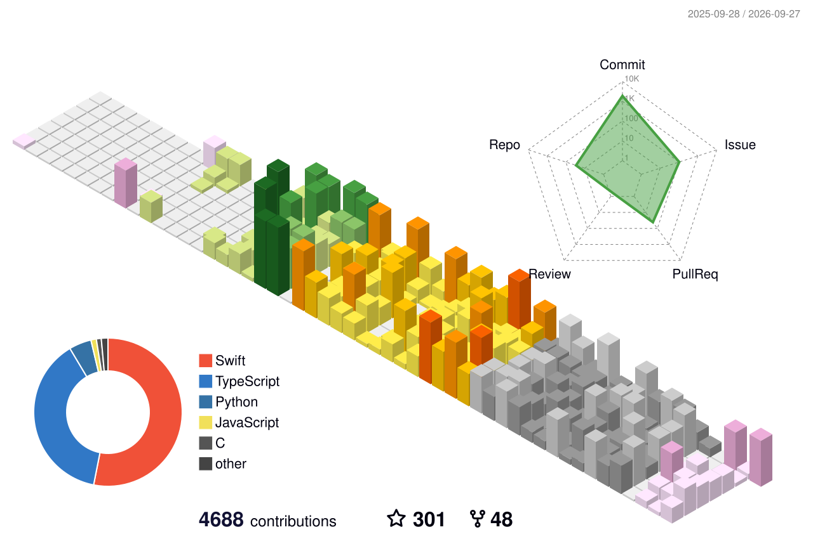

### Welcome !
**Apps I built and use every day:**

• [PastePaw](https://pastepaw.com) - 🐾 An elegant clipboard history manager for macOS & [Windows](https://github.com/XueshiQiao/PastePaw) 🐾  
• [QDuo](https://github.com/XueshiQiao/qduo) - Select text in any app, and your own actions appear right at the cursor — translate, polish, search, speak, transform, or ask a model, and put the result straight back.  
• [AnyDrag](https://github.com/XueshiQiao/AnyDrag) - Modifier+drag to move any window smoothly on macOS, exactly like native speed  
• [HyperCapslock](https://github.com/XueshiQiao/HyperCapslock) - Make your capslock powerful (macOS)  
• [CCSwitcher](https://github.com/XueshiQiao/CCSwitcher) - Menubar app, Switch your Claude  Code account with clicks, show session and weekly usage 
• [netstat-cat ](https://github.com/XueshiQiao/netstat-cat) - GUI application for netstat (macOS & Windows)  
• [Notifier](https://github.com/XueshiQiao/Notifier) - Never miss a AI Agent prompt again (macOS)  

see more on [xueshi.dev](https://xueshi.dev)

**Claude Code Plugins / SKills:**

• [macos-app-scaffold](https://github.com/XueshiQiao/macos-app-scaffold) - Claude Code plugin to scaffold and enhance production-ready macOS apps  

<!-- Switch the SVG image based on the current theme, whether dark or light. -->
<picture> 
  <source media="(prefers-color-scheme: dark)" srcset="profile-3d-contrib/profile-night-rainbow.svg">
  <source media="(prefers-color-scheme: light)" srcset="profile-3d-contrib/profile-south-season.svg">
  
</picture>
